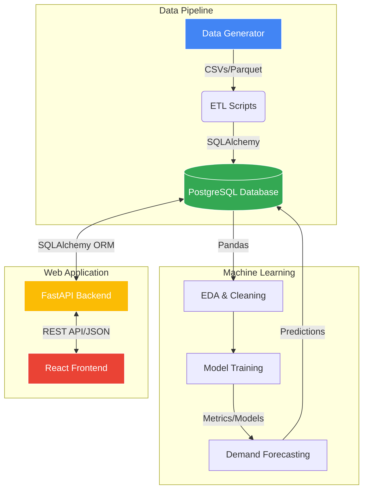

<div align="center">

# 🛒 RetailIQ

**Enterprise Retail Analytics & Demand Forecasting Platform**

[](https://fastapi.tiangolo.com/)
[](https://reactjs.org/)
[](https://www.postgresql.org/)
[](https://www.python.org/)
[](https://www.docker.com/)

An end-to-end analytics ecosystem featuring synthetic data generation, robust ETL pipelines, machine learning demand forecasting, and a full-stack interactive dashboard.

[Explore the Docs](./DOCUMENTATION.md) • [Report Bug](#-support) • [Request Feature](#-support)

</div>

---

## 📖 Table of Contents

- [About the Project](#-about-the-project)
- [Comprehensive Documentation](#-comprehensive-documentation)
- [Key Features](#-key-features)
- [Architecture](#-architecture)
- [Tech Stack](#-tech-stack)
- [Project Structure](#-project-structure)
- [Getting Started](#-getting-started)
  - [Prerequisites](#prerequisites)
  - [Docker Installation (Recommended)](#docker-installation-recommended)
  - [Local Development Setup](#local-development-setup)
- [Usage](#-usage)
  - [Data Pipeline](#data-pipeline)
  - [Default Credentials](#default-credentials)
- [Deployment Guides](#-deployment-guides)
- [SQL Query Bank](#-sql-query-bank)
- [License](#-license)

---

## 🌟 About the Project

**RetailIQ** is a comprehensive, production-ready enterprise solution designed to demonstrate advanced capabilities in data engineering, machine learning, and full-stack web development. It simulates a modern retail environment, processing millions of rows of data to extract actionable insights, optimize inventory, and forecast future demand.

Whether you're exploring the intricacies of PostgreSQL optimization, the performance of FastAPI, or the dynamic capabilities of React, RetailIQ provides a robust playground and a scalable template for real-world applications.

---

## 📚 Comprehensive Documentation

For a detailed deep dive into the system architecture, database schema, API endpoints, module breakdown, and developer guides, please refer to our complete professional documentation:

👉 **[View Complete Documentation](./DOCUMENTATION.md)**

---

## ✨ Key Features

### 🛠 Data Engineering & Synthesis
- **Massive Data Generation:** Synthesize millions of realistic Indian retail records across customers, products, orders, returns, and payments.
- **Robust ETL Pipelines:** Extract, transform, and load data seamlessly into a normalized PostgreSQL schema.
- **Advanced SQL:** 12+ normalized tables, materialized views, B-Tree/GIN indexes, and stored procedures for complex business logic.

### 🧠 Machine Learning Forecasting
- **Demand Prediction:** Advanced models utilizing XGBoost, Random Forest, Ridge, and Linear Regression.
- **Robust Validation:** Comprehensive backtesting and metric evaluation (RMSE, MAE, R²) to ensure high confidence in forecasting.
- **Inventory Optimization:** Smart recommendations for stock replenishment and price adjustments.

### 💻 Full-Stack Interactive Application
- **High-Performance Backend:** Asynchronous REST API built with FastAPI, secured via JWT authentication, and structured with SQLAlchemy and Pydantic.
- **Dynamic Frontend:** A beautiful, responsive React dashboard featuring a glassmorphism dark theme and rich Recharts visualizations.

---

## 🏛 Architecture



---

## ⚙️ Tech Stack

| Domain | Technologies |
| :--- | :--- |
| **Frontend** | React, Vite, Recharts, Tailwind CSS (or Vanilla CSS Modules), Axios |
| **Backend** | FastAPI, Python 3.10+, SQLAlchemy, Pydantic, Passlib, JWT |
| **Database** | PostgreSQL 15+, pgAdmin |
| **Data & ML** | Pandas, NumPy, Scikit-learn, XGBoost, Faker |
| **Infrastructure** | Docker, Docker Compose |

---

## 📂 Project Structure

```text
RetailIQ/
├── analytics/         # 🐍 Python data pipelines, generation, EDA, & ML
├── backend/           # ⚡ FastAPI application (REST endpoints, business logic)
├── frontend/          # ⚛️ React single-page application (Dashboard)
├── database/          # 🗄️ SQL schema, indexes, views, procedures & query bank
├── data/              # 📁 Local storage for generated CSVs/parquet files
├── ml/                # 🧠 Saved ML models, scalers, and metric reports
├── docs/              # 📚 Documentation and architecture diagrams
├── reports/           # 📊 Markdown validation reports and EDA figures
├── docker-compose.yml # 🐳 Container orchestration configuration
└── README.md          # 📖 Project documentation
```

---

## 🚀 Getting Started

Follow these instructions to get a copy of the project up and running on your local machine.

### Prerequisites

Ensure you have the following installed:
- [Docker](https://www.docker.com/products/docker-desktop/) & [Docker Compose](https://docs.docker.com/compose/install/) (Easiest setup)
- [Node.js 18+](https://nodejs.org/) (For local frontend development)
- [Python 3.10+](https://www.python.org/downloads/) (For local backend/analytics development)
- [PostgreSQL 15+](https://www.postgresql.org/download/) (If running without Docker)

### Docker Installation (Recommended)

The easiest way to spin up the entire platform is via Docker.

1. **Clone the repository (if not already done)**
   ```bash
   git clone https://github.com/yourusername/RetailIQ.git
   cd RetailIQ
   ```

2. **Configure Environment Variables**
   ```bash
   cp .env.example .env
   # Edit .env with your specific configurations if necessary
   ```

3. **Start the Platform**
   ```bash
   docker-compose up --build
   ```

4. **Access the Services**
   - **Frontend Dashboard:** `http://localhost:5173`
   - **Backend API:** `http://localhost:8000`
   - **Swagger API Docs:** `http://localhost:8000/docs`
   - **pgAdmin (if configured):** `http://localhost:5050`

### Local Development Setup

If you prefer to run services individually without Docker:

**1. Database Setup:**
Ensure your local PostgreSQL server is running and create a database named `retail_iq`. Run the scripts in `database/` to set up the schema.

**2. Backend Setup:**
```bash
cd backend
python -m venv venv
source venv/bin/activate  # On Windows: venv\Scripts\activate
pip install -r requirements.txt
uvicorn app.main:app --reload
```

**3. Frontend Setup:**
```bash
cd frontend
npm install
npm run dev
```

---

## 💻 Usage

### Data Pipeline

To generate the synthetic data and populate the database locally (useful for testing models without the full app):

```bash
cd analytics
pip install -r requirements.txt
python data_generation.py     # Generates CSVs in /data
python data_validation.py     # Validates generated data
python load_data.py           # Loads data into PostgreSQL
```

### Default Credentials

The platform comes pre-seeded with the following roles for testing auth:

| Role | Username | Password |
| :--- | :--- | :--- |
| **Admin** | `admin` | `admin123` |
| **Analyst** | `analyst` | `analyst123` |
| **Viewer** | `viewer` | `viewer123` |

---

## ☁️ Deployment

RetailIQ is deployed using the following configuration:

### Frontend (Vercel)
The React frontend is optimized for deployment on **Vercel**. 
1. A `vercel.json` is included in the `frontend/` directory to handle Single Page Application (SPA) routing correctly:
   ```json
   {
     "rewrites": [
       { "source": "/(.*)", "destination": "/index.html" }
     ]
   }
   ```
2. Connect your repository to Vercel, set the Framework Preset to `Vite`, and the root directory to `frontend`.

### Backend API Configuration
To ensure seamless communication between the Vercel-hosted frontend and the backend API, CORS is configured in `backend/main.py` to allow cross-origin requests:
```python
app.add_middleware(
    CORSMiddleware,
    allow_origins=["*"],
    allow_credentials=False,
    allow_methods=["*"],
    allow_headers=["*"],
)
```

---

## 🔍 SQL Query Bank

The `database/queries/` directory is a goldmine for data analysts. It contains 50+ highly optimized analytical SQL queries that power the platform.

These cover:
- Basic aggregations and reporting
- Complex `JOIN` operations across multiple entities
- `WINDOW` functions for running totals and moving averages
- Common Table Expressions (`CTEs`) for readable complex logic

These queries can be used directly in tools like pgAdmin, DBeaver, or Metabase.

---

## 🤝 Contributing

Contributions are what make the open source community such an amazing place to learn, inspire, and create. Any contributions you make are **greatly appreciated**.

1. Fork the Project
2. Create your Feature Branch (`git checkout -b feature/AmazingFeature`)
3. Commit your Changes (`git commit -m 'Add some AmazingFeature'`)
4. Push to the Branch (`git push origin feature/AmazingFeature`)
5. Open a Pull Request

---

## ✍️ Author

**RetailIQ Development Team**
Designed and built for advanced enterprise retail analytics.

---

## 📄 License

This project is licensed under the **MIT License** - see the [LICENSE](LICENSE) file for details.

---

<div align="center">
  <i>Built with ❤️ for enterprise analytics.</i>
</div>
