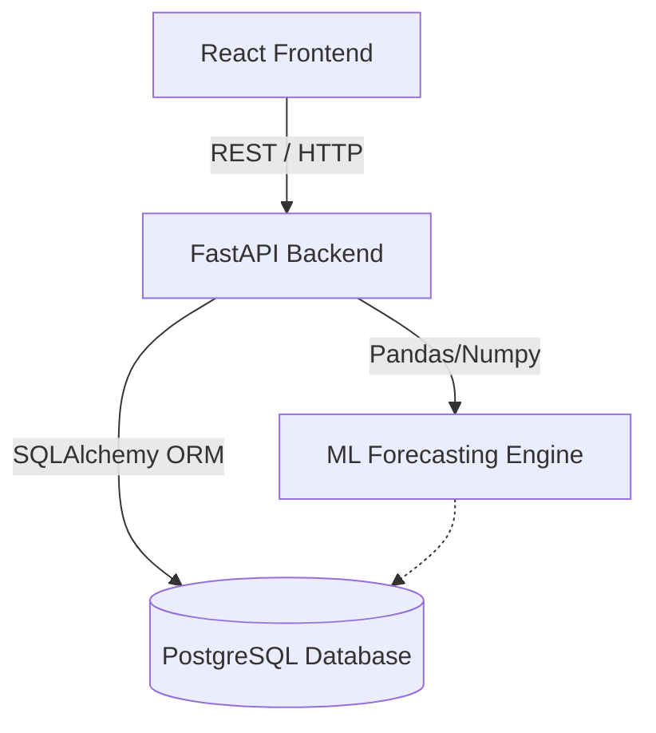
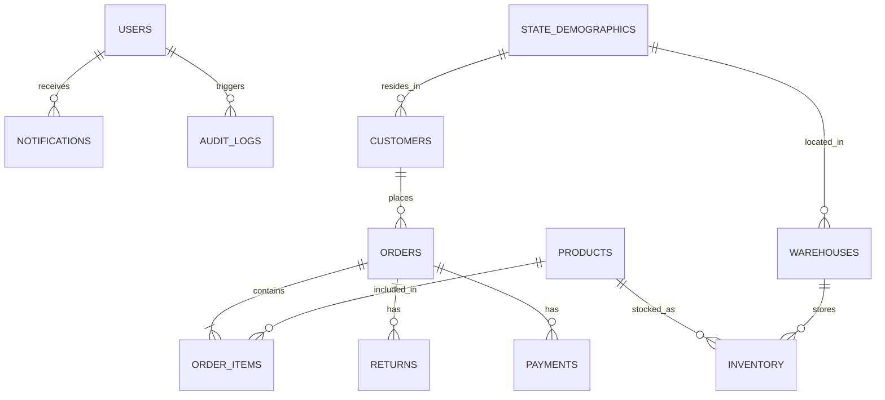
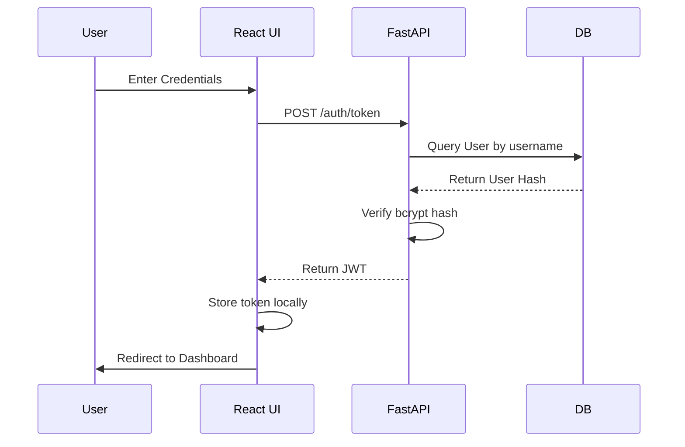

<div align="center">

# 🛒 RetailIQ

**Enterprise Retail Analytics & Demand Forecasting Platform**

[](https://fastapi.tiangolo.com/)
[](https://reactjs.org/)
[](https://www.postgresql.org/)
[](https://www.python.org/)
[](https://www.docker.com/)

An end-to-end analytics ecosystem featuring robust ETL pipelines, machine learning demand forecasting, and a full-stack interactive dashboard.

[Explore Documentation](#-comprehensive-documentation) • [Report Bug](#-support) • [Request Feature](#-support)

</div>

---

## 📖 Table of Contents

- [About the Project](#-about-the-project)
- [Key Features](#-key-features)
- [Architecture](#-architecture)
- [Tech Stack](#-tech-stack)
- [Project Structure](#-project-structure)
- [Getting Started](#-getting-started)
- [Usage & Workflows](#-usage--workflows)
- [📚 Comprehensive Documentation (Deep Dive)](#-comprehensive-documentation-deep-dive)
- [Deployment Guides](#-deployment-guides)
- [Contributing & License](#-contributing)

---

## 🌟 About the Project

**RetailIQ** is a comprehensive, production-ready enterprise solution designed to demonstrate advanced capabilities in data engineering, machine learning, and full-stack web development. It simulates a modern retail environment, processing large datasets to extract actionable insights, optimize inventory, and forecast future demand. 

Retailers often struggle with siloed data, leading to overstocking, stockouts, sub-optimal pricing, and poor customer segmentation. RetailIQ automates data pipelining and applies statistical models to immediately surface what needs attention today and what will be needed tomorrow.

---

## ✨ Key Features

### 🛠 Data Engineering & Synthesis
- **Robust ETL Pipelines:** Extract, transform, and load data seamlessly into a normalized PostgreSQL schema.
- **Advanced SQL:** 12+ normalized tables, materialized views, B-Tree/GIN indexes, and stored procedures for complex business logic.

### 🧠 Machine Learning Forecasting
- **Demand Prediction:** Advanced models utilizing XGBoost, Scikit-Learn, and Statsmodels (Holt-Winters Exponential Smoothing).
- **Inventory Optimization:** Smart recommendations for stock replenishment and stockout risk detection using Exponentially Weighted Moving Averages (EWMA).

### 💻 Full-Stack Interactive Application
- **High-Performance Backend:** Asynchronous REST API built with FastAPI, secured via JWT authentication.
- **Dynamic Frontend:** A beautiful, responsive React dashboard featuring a glassmorphism dark theme and rich Recharts visualizations.

---

## 🏛 Architecture



---

## ⚙️ Tech Stack

| Domain | Technologies |
| :--- | :--- |
| **Frontend** | React 19, Vite, Recharts, Tailwind CSS (Vanilla CSS Modules), Axios |
| **Backend** | FastAPI, Python 3.10+, SQLAlchemy, Pydantic, Passlib, JWT |
| **Database** | PostgreSQL 15+, pgAdmin |
| **Data & ML** | Pandas, NumPy, Scikit-learn, XGBoost, Statsmodels |
| **Infrastructure** | Docker, Docker Compose, Nginx |

---

## 📂 Project Structure

```text
RetailIQ/
├── analytics/         # 🐍 Python data pipelines, BigQuery scripts & ML
├── backend/           # ⚡ FastAPI application (REST endpoints, business logic)
├── frontend/          # ⚛️ React single-page application (Dashboard)
├── database/          # 🗄️ SQL schema, indexes, views, procedures & query bank
├── docker-compose.yml # 🐳 Container orchestration configuration
└── README.md          # 📖 Project documentation
```

---

## 🚀 Getting Started

### Prerequisites
- [Docker](https://www.docker.com/products/docker-desktop/) & [Docker Compose](https://docs.docker.com/compose/install/) (Easiest setup)
- [Node.js 18+](https://nodejs.org/) and [Python 3.10+](https://www.python.org/downloads/) (For local development)

### Docker Installation (Recommended)

1. **Clone the repository**
   ```bash
   git clone https://github.com/yourusername/RetailIQ.git
   cd RetailIQ
   ```
2. **Configure Environment Variables**
   ```bash
   cp .env.example .env
   ```
3. **Start the Platform**
   ```bash
   docker-compose up --build -d
   ```
4. **Access the Services**
   - **Frontend Dashboard:** `http://localhost:3000`
   - **Backend API:** `http://localhost:8000`
   - **pgAdmin:** `http://localhost:5050`

---

## 💻 Usage & Workflows

### Default Credentials
The platform comes pre-seeded with the following roles for testing auth:
| Role | Username | Password |
| :--- | :--- | :--- |
| **Admin** | `admin` | `admin123` |
| **Analyst** | `analyst` | `analyst123` |
| **Viewer** | `viewer` | `viewer123` |

### Business Workflow
1. **Data Ingestion:** Sales and inventory data flow into PostgreSQL.
2. **Analysis:** System aggregates daily sales into monthly buckets.
3. **Forecasting:** Background processes run Holt-Winters models to project future trends.
4. **Action:** Dashboard highlights items falling below reorder levels allowing managers to review stockout risks.

---

## 📚 Comprehensive Documentation (Deep Dive)

<details>
<summary><b>1. System Requirements & Objectives</b></summary>
<br>

**Objectives:**
*   **Technical:** Achieve <200ms API response times and robust fault tolerance using containerized microservices architecture.
*   **Business:** Increase inventory turnover ratio by 1.5x within the first year of adoption.
*   **Performance:** Handle 10,000+ concurrent analytical queries using database indexing and caching.
*   **Security:** Ensure full compliance with data privacy standards via strict JWT RBAC and password hashing.

**Hardware:**
*   **Minimum:** 2 vCPU, 4GB RAM, 20GB SSD 
*   **Recommended:** 4+ vCPU, 16GB RAM, 100GB+ SSD 

</details>

<details>
<summary><b>2. Database Documentation & ER Diagram</b></summary>
<br>

**ER Diagram Overview:**


**Normalization & Schema:**
Schema is normalized to 3NF. Redundancy is minimized.
*   **`users`**: `user_id` (PK), `username`, `email`, `hashed_password`, `role`.
*   **`products`**: `product_id` (PK), `name`, `category`, `price`, `cost_price`.
*   **`orders`**: `order_id` (PK), `customer_id` (FK), `order_date`, `total_amount`.
*   **`inventory`**: `inventory_id` (PK), `warehouse_id` (FK), `stock_quantity`, `reorder_level`.

</details>

<details>
<summary><b>3. API Documentation</b></summary>
<br>

**Endpoint:** `GET /api/forecast`
*   **Method:** GET
*   **Authentication:** Bearer JWT required.
*   **Query Params:** `scenario_modifier` (float, default 1.0), `risk_only` (boolean).
*   **Response (200 OK):**
```json
{
  "data": [{"month": "Jul 2026", "forecast": 150000.00, "lower_bound": 140000, "upper_bound": 160000}],
  "metrics": {"mae": 500.2, "rmse": 750.4, "mape": 4.5},
  "products": [{"name": "Laptop", "forecast_units": 150, "current_stock": 50}]
}
```

**Endpoint:** `POST /api/auth/token`
*   **Method:** POST
*   **Request:** OAuth2 Password form (`username`, `password`).
*   **Response:** `{"access_token": "jwt...", "token_type": "bearer"}`
</details>

<details>
<summary><b>4. Security & Authentication</b></summary>
<br>

**Authentication Sequence:**


*   **Hashing:** Passwords hashed via `bcrypt`.
*   **SQL Injection:** Prevented by SQLAlchemy ORM.
*   **XSS & CSRF:** Handled natively by React DOM escaping and local JWT token storage.
</details>

<details>
<summary><b>5. Performance & Error Handling</b></summary>
<br>

*   **Database Indexing:** Created on heavy filtering columns (`order_date`, `category`).
*   **Backend Caching:** `ForecastCache` stores heavy ML computations in-memory for 1 hour.
*   **Frontend Optimization:** Vite minifies and chunks bundles. React Query caches HTTP responses.
*   **Error Handling:** Axios interceptors catch 401s to auto-logout. Pydantic handles 422 errors automatically.
</details>

<details>
<summary><b>6. DevOps & Maintenance Guide</b></summary>
<br>

*   **Environment:** Dockerized ecosystem (`retailiq_postgres`, `retailiq_backend`, `retailiq_frontend`).
*   **Backups:** Snapshot the `postgres_data` Docker volume. Utilize `pg_dump` via cronjob.
*   **Updates:** Alter `requirements.txt` / `package.json` and rebuild Docker images.
*   **Scaling:** Detach PostgreSQL to a managed cloud service (e.g., AWS RDS) as load increases.
</details>

<details>
<summary><b>7. Developer & Handover Guide</b></summary>
<br>

New developers should begin by reading `backend/main.py` to understand the API entry points, followed by `backend/app/models/database_models.py` for the schema. 
For frontend, review `src/pages` to see how components map to routes, and `src/api.js` for data fetching patterns. Always use `docker-compose up` for local testing to ensure parity with production.
</details>

---

## ☁️ Deployment Guides

### Frontend (Vercel)
The React frontend is optimized for deployment on **Vercel**. A `vercel.json` is included in the `frontend/` directory to handle Single Page Application (SPA) routing correctly. Connect your repository to Vercel, set the Framework Preset to `Vite`, and the root directory to `frontend`.

### Backend API Configuration
To ensure seamless communication between the Vercel-hosted frontend and the backend API, CORS is configured in `backend/main.py`.

---

## 🤝 Contributing

Contributions are what make the open source community such an amazing place to learn, inspire, and create. Any contributions you make are **greatly appreciated**.

1. Fork the Project
2. Create your Feature Branch (`git checkout -b feature/AmazingFeature`)
3. Commit your Changes (`git commit -m 'Add some AmazingFeature'`)
4. Push to the Branch (`git push origin feature/AmazingFeature`)
5. Open a Pull Request

---

## ✍️ Author & License

**RetailIQ Development Team**
Designed and built for advanced enterprise retail analytics.

This project is licensed under the **MIT License** - see the [LICENSE](LICENSE) file for details.

---

<div align="center">
  <i>Built with ❤️ for enterprise analytics.</i>
</div>
