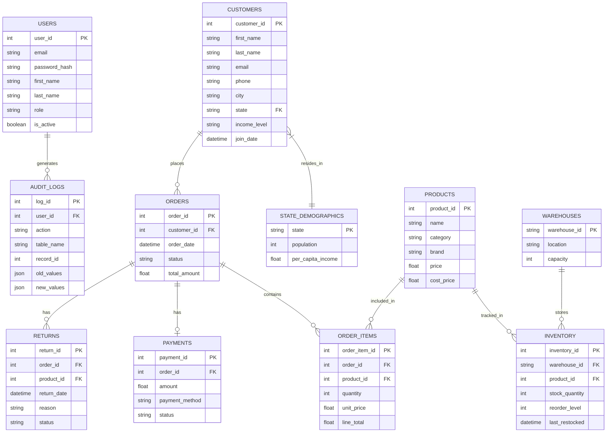

# RetailIQ Entity Relationship Diagram

```mermaid
erDiagram
    USERS ||--o{ AUDIT_LOGS : generates
    CUSTOMERS ||--o{ ORDERS : places
    CUSTOMERS }|--|| STATE_DEMOGRAPHICS : resides_in
    ORDERS ||--o{ ORDER_ITEMS : contains
    ORDERS ||--o| PAYMENTS : has
    ORDERS ||--o{ RETURNS : has
    PRODUCTS ||--o{ ORDER_ITEMS : included_in
    PRODUCTS ||--o{ INVENTORY : tracked_in
    WAREHOUSES ||--o{ INVENTORY : stores

    USERS {
        int user_id PK
        string email
        string password_hash
        string first_name
        string last_name
        string role
        boolean is_active
    }

    CUSTOMERS {
        int customer_id PK
        string first_name
        string last_name
        string email
        string phone
        string city
        string state FK
        string income_level
        datetime join_date
    }

    STATE_DEMOGRAPHICS {
        string state PK
        int population
        float per_capita_income
    }

    ORDERS {
        int order_id PK
        int customer_id FK
        datetime order_date
        string status
        float total_amount
    }

    ORDER_ITEMS {
        int order_item_id PK
        int order_id FK
        int product_id FK
        int quantity
        float unit_price
        float line_total
    }

    PRODUCTS {
        int product_id PK
        string name
        string category
        string brand
        float price
        float cost_price
    }

    INVENTORY {
        int inventory_id PK
        string warehouse_id FK
        int product_id FK
        int stock_quantity
        int reorder_level
        datetime last_restocked
    }

    WAREHOUSES {
        string warehouse_id PK
        string location
        int capacity
    }
    
    PAYMENTS {
        int payment_id PK
        int order_id FK
        float amount
        string payment_method
        string status
    }

    RETURNS {
        int return_id PK
        int order_id FK
        int product_id FK
        datetime return_date
        string reason
        string status
    }

    AUDIT_LOGS {
        int log_id PK
        int user_id FK
        string action
        string table_name
        int record_id
        json old_values
        json new_values
    }
```
